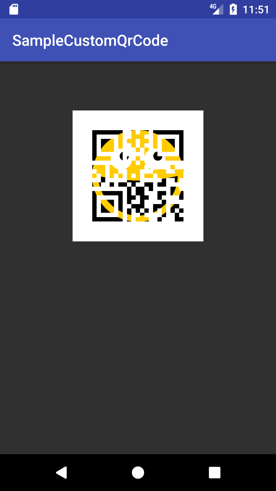

Android library for build QrCodes with inside images.
=====================================================

<div align="center">

</div>

Usage Maven Repo
----------------

I've uploaded the `.aar` in my maven repository. You only need to add following lines to your `build.gradle` to add the dependency:
```groovy
dependencies {
    compile 'br.fgr.customqrcode:customqrcode:1.0'
}
```

How To Use
----------
```java
CustomQrCode.Builder builder = CustomQrCode.Builder(Context context, ImageView imgQrCode, String text);

// Optional
builder.setSize(int size).setResource(int drawable).setProgress(View progress);

builder.build().execute();
```


Example
----------
```java
CustomQrCode.Builder builder = CustomQrCode.Builder(this, imgQrCode, "Hello World");
builder.setSize(512).setResource(R.drawable.smiley).setProgress(progress);

builder.build().execute();
```